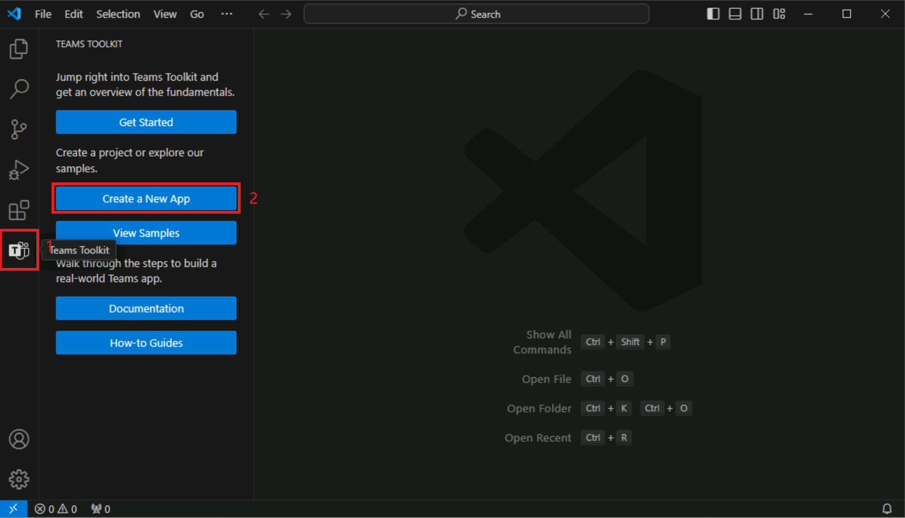

# Exercício 2: Criar um aplicativo do Teams usando o Teams Toolkit

O Teams Toolkit para Visual Studio Code oferece dois métodos para criar um aplicativo. Você pode criar um aplicativo usando os modelos internos fornecidos pelo kit de ferramentas. Além disso, o Teams Toolkit para Visual Studio Code oferece uma coleção de amostras que estão prontas para você explorar e criar o seu aplicativo base. 

Neste exercício, você vai criar seu primeiro aplicativo do Microsoft Teams usando os modelos internos.

## Tarefa 1: Criar um novo aplicativo do Microsoft Teams

1. Na barra lateral Visual Studio Code, selecione o botão Kit de Ferramentas do Teams para abrir o **Kit de Ferramentas do Teams**.
1. No Kit de Ferramentas do Teams, selecione **Criar um novo aplicativo**.

   

1. No menu Novo Projeto, selecione** **Guia**.

   
   
1. Quando precisar escolher uma funcionalidade, selecione **Guia Básica**.
1. Quando solicitado a selecionar uma linguagem de programação, selecione **TypeScript**.
1. Quando solicitado a selecionar uma pasta, selecione **Pasta padrão** ou escolha um local de arquivo diferente.
1. **Insira um nome de aplicativo** de sua escolha para seu aplicativo de guia básica e selecione **ENTER**.
1. O Kit de Ferramentas do Teams fará o scaffold de um novo aplicativo e abrirá a pasta do projeto no Visual Studio Code.
1. Você pode receber uma mensagem do Visual Studio Code perguntando se você confia nos autores dos arquivos nesta pasta. Selecione o botão **Sim, confio nos autores** para continuar.

   

1. Agora você pode exibir o código do projeto, que inclui:

- O código do aplicativo do Teams.
- Arquivos de implantação e manifesto dentro da pasta appPackage.
- Variáveis de ambiente dentro da pasta de ambiente.
- Um arquivo README que fornece as etapas necessárias para executar, depurar e implantar o aplicativo.

  
