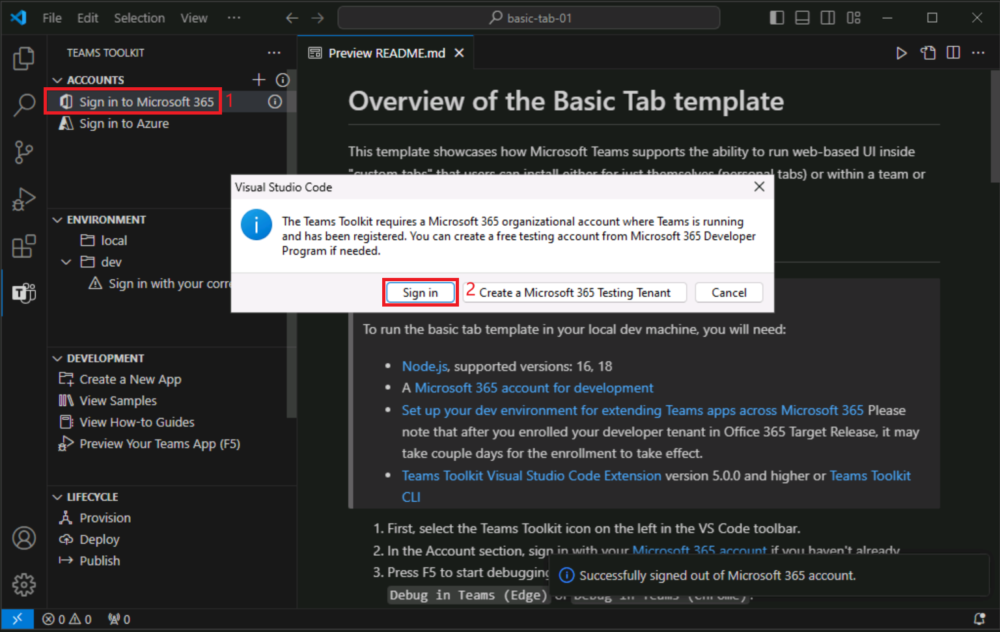

# Exercício 3: Executar seu aplicativo do Teams

Neste exercício, você executará o aplicativo do Teams localmente.

## Tarefa 1: Entre no Microsoft 365

1. No Visual Studio Code, abra **Kit de Ferramenta do Teams** e selecione **Entrar no Microsoft 365**.

    

2. Na caixa de diálogo pop-up, selecione **Entrar**. Você será direcionado a um navegador para entrar com as **credenciais da sua conta do Microsoft 365**.  Insira suas credenciais de administrador.

3. Quando estiver conectado com êxito, feche o navegador e retorne ao Visual Studio Code. Uma mensagem **Upload de aplicativo personalizado habilitado** aparecerá na sua conta no Kit de Ferramenta do Teams para indicar que o locatário está configurado corretamente.

    

## Tarefa 2: Executar o aplicativo localmente

Vamos executar o projeto e ver como ele ficará no Microsoft Teams.

1. Na barra lateral, selecione o ícone **Depurar** para abrir o painel **EXECUTAR E DEPURAR**.
2. No painel **EXECUTAR E DEPURAR**, selecione **Chrome** ou **Edge** na caixa de listagem suspensa como o navegador que você deseja usar para depurar o bot.  Em seguida, selecione o botão **Executar** (ou selecione a tecla **F5**) para iniciar a sessão de depuração.
3. O Kit de Ferramenta do Teams concluirá a verificação dos pré-requisitos (que pode levar um ou dois minutos).
4. Em seguida, o Kit de Ferramenta do Teams abrirá o Microsoft Teams no navegador que você selecionou.
5. Entre com a mesma conta do **Microsoft 365** que você usou para entrar no Kit de Ferramenta do Teams.
6. Em seguida, o Teams exibirá uma opção para instalar seu aplicativo. Selecione **Adicionar** para pré-visualizar o aplicativo.
7. Quando você estiver pré-visualizando, o nome do seu aplicativo será sufixado com *local*. O sufixo indica que o aplicativo está sendo executado localmente e não foi implantado.

    

8. Para saber mais sobre a estrutura do projeto e como usar e personalizar o aplicativo, abra o arquivo **README.md** na pasta do projeto.

Agora você criou um aplicativo do Teams a partir de uma amostra e o executou localmente.
