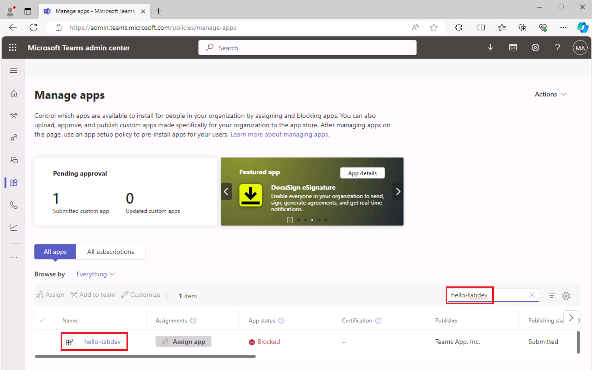

# Exercício 3: Publicar seu aplicativo de guia Teams

Neste exercício, você aprenderá a publicar seu aplicativo na loja da organização.

## Tarefa 1: Publicar seu aplicativo na loja

1. No Visual Studio Code, na Barra de Atividades, selecione o ícone **Microsoft Teams** para abrir o painel **Kit de Ferramenta do Teams**.

    

1. No painel Kit de Ferramenta do Teams, em **Ciclo de Vida**, selecione **Publicar**.

1. Uma caixa de diálogo indica que o aplicativo foi publicado com êxito no portal de administração do Microsoft Teams.

1. Na caixa de diálogo, selecione **Ir para o portal de administração** para abrir o **Centro de administração do Microsoft Teams**.  Entre com sua conta de locatário do **Microsoft 365**.

    a. 

    b. 

1. No menu **Gerenciar aplicativos** do centro de administração do Teams, localize a caixa de texto **Pesquisar por nome**. 
1. Insira **hello-tabdev** para filtrar a lista de aplicativos. Em seguida, **selecione o aplicativo** para ver os detalhes do aplicativo.

    

1. No painel de detalhes do aplicativo **hello-tabdev**, selecione **Publicar**.

    

1. Na caixa de diálogo **Publicar seu aplicativo personalizado?**, selecione **Publicar**.

1. Uma faixa verde indica que o aplicativo hello-tab foi publicado.

    

Agora que seu aplicativo está publicado na loja da organização, abra o Microsoft Teams e instale o aplicativo da loja da organização.

## Tarefa 2: Instale o aplicativo na loja

1. Abra o cliente do Microsoft Teams ou entre no Microsoft Teams online ([teams.microsoft.com](https://teams.microsoft.com/)) usando suas credenciais de locatário do **Microsoft 365**.
2. No Microsoft Teams, vá para **Aplicativos** para exibir o repositório da organização. Em **Construído para a sua organização**, selecione o bloco **hello-tabdev**.

    a. 

3. Na caixa de diálogo de instalação do aplicativo, selecione **Adicionar**.

    a. 

4. O aplicativo é aberto e a mensagem **Seu aplicativo está sendo executado no ambiente do Azure** é exibida.

    
